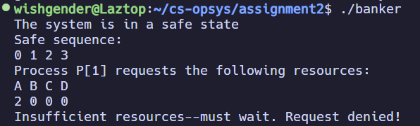

# Operating Systems Assignment 2

Assignment 2 for Operating Systems (CS 33211) at Kent State University

Instructor: Jinhui Ma

Student: Lazuli Rogers

## Included Files

* Source
  * [main.cpp](./main.cpp)
  * [System.hpp](./System.hpp)
  * [System.cpp](./System.cpp)
  * [inputGen.cpp](./inputGen.cpp)
    * if you want to generate random input files
* Compilation
  * [makefile](./makefile)
* Examples
  * [Sample Input](./examples/example-input.bank)
  * [Expected Output Screenshots](./examples/exampleOutput.png)

### Source

This program consists of a main file, a System class implemented in `System.hpp` and `System.cpp`, and a separate random input generation program in `inputGen.cpp`

### Input file

You must have a file that contains the following system information, formatted as such:

```
n

m

Instances[1], Instances[2], ..., Instances[m]

Allocation[0][0], Allocation[0][1], ..., Allocation[0][m]
Allocation[1][0], Allocation[1][1], ..., Allocation[1][m]
...
Allocation[n][0], Allocation[n][1], ..., Allocation[n][m]

Max[0][0], Max[0][1], ..., Max[0][m]
Max[1][0], Max[1][1], ..., Max[1][m]
...
Max[n][0], Max[n][1], ..., Max[n][m]

Available[1], Available[2], ..., Available[m]

```

where `n` is the number of processes, `m` is the number of resource types, `Instances` is a vector of size `m` that indicates how many instances there are of each resource type, `Allocation` is a `n` x `m` matrix indicating how many instances of each resource type each process is currently using, `Max` is a `n` x `m` matrix indicating how many instances of each resource type each process could potentially request, and `Available` is a vector of size `m` that indicates how many instances of each resource type are currently free to be used by a process.

See [Example Input](./example-input.bank) for a valid example input file

A random input file can be generated with `inputGen.cpp`.

`main.cpp` contains a string constant `inputPath` that can be configured to use a different input file, but it will look for `input.bank` by default (this is the name of the file that `inputGen` produces).

## Build Instructions

### Compiling

The program compiles with the included `makefile`.

Running `make` will compile both the main program and the input generation program.

It is compatible with the g++, clang++, gcc, and clang commands.

Select your compiler with one of the following command-line arguments. G++ is the default and will be used if no compiler is specified.

```
make CXX=g++
make CXX=clang++
make CXX=gcc
make CXX=clang
```

## Execution Instructions

### Generating Input

`./inputGen` will generate a new random input file `input.bank` if it doesn't exist; if it *does* already exist, it will be overwritten with new data.

### Executing the Banker's Algorithm

`./banker` will run the main program. It will read the data in `input.bank` and determine whether or not it is in a safe state. If it is in a safe state, the safe sequence will be printed to the console.

## Expected Output

When properly executed, the output should look like this:

### Safe Output



### Unsafe Output


